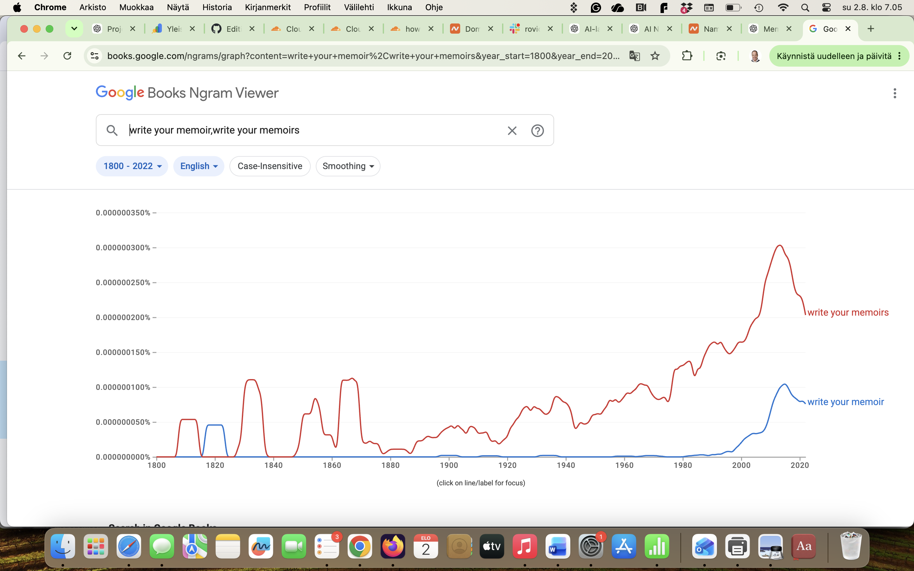
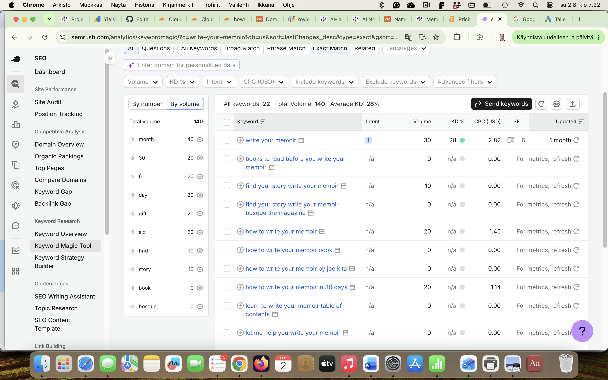
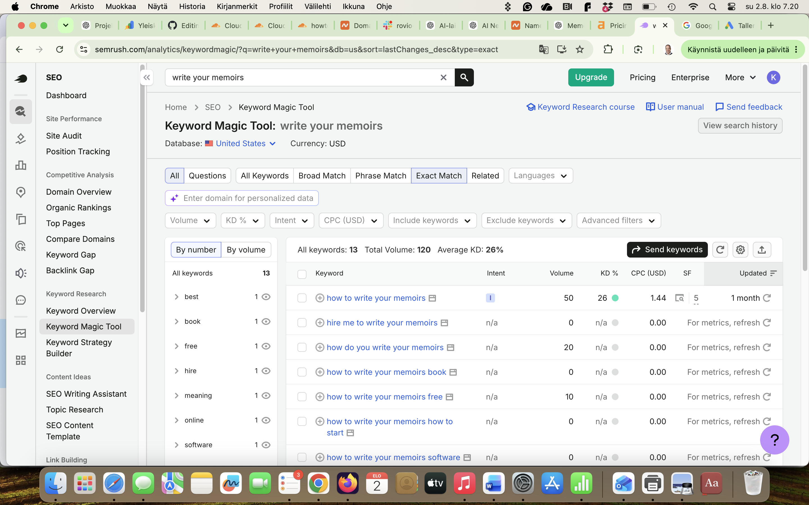

# Domain Selection Validation

## Purpose

The purpose of this validation is to verify that the experimental setup does not unintentionally favor the Targetlytics-optimized website through a stronger domain name.

If one of the candidate domains appears to have a stronger linguistic profile or greater search demand, that domain should preferably be assigned to the control website rather than the optimized website.

This makes the experiment more conservative: if the optimized website still performs better, the result is less likely to be explained by the domain name itself.

---

# Candidate Domains

| Website | Domain |
|---------|--------|
| Targetlytics Website | HowToWriteYourMemoir.com |
| Control Website | HowToWriteYourMemoirs.com |

---

# Validation

## 1. Google Books Ngram Viewer

Historical usage was compared using Google Books Ngram Viewer.

Compared expressions:

- write your memoir
- write your memoirs

Result:

The plural expression **"write your memoirs"** has appeared more frequently in published English-language books than **"write your memoir"**.

This suggests that the plural expression has historically been the more common form.

---

## 2. Semrush Keyword Research

Keyword demand was evaluated using Semrush (United States database).

### write your memoir

Monthly search volume:

**30 searches/month**

---

### write your memoirs

Monthly search volume:

**50 searches/month**

---

# Findings

Two independent datasets were evaluated.

## Google Books

Historical usage favors

> write your memoirs

over

> write your memoir.

## Semrush

Current keyword demand also favors

> write your memoirs

with approximately 67% higher monthly search volume.

Although the absolute search volumes are relatively small, both sources point in the same direction.

---

# Experimental Design Decision

To avoid giving the optimized website an inherent advantage, the domain with the stronger baseline signals was assigned to the **control website**.

The Targetlytics website therefore intentionally uses the domain:

> **HowToWriteYourMemoir.com**

while the control website uses

> **HowToWriteYourMemoirs.com**

This makes the experiment conservative.

If the Targetlytics website eventually outperforms the control website in search visibility or AI recommendation frequency, the observed improvement cannot reasonably be attributed to a superior domain name.

Instead, the result would have occurred despite the optimized website starting with a domain that appears slightly less favorable according to historical language usage and keyword demand.

---

# Limitations

This validation does **not** demonstrate that domain names directly influence Google rankings or AI recommendation systems.

The analysis only shows that one linguistic form appears more common than the other according to:

- Google Books Ngram Viewer
- Semrush keyword data

Search rankings and AI recommendations depend on numerous additional factors including content quality, topical authority, backlinks, technical SEO, user behavior, and AI retrieval mechanisms.

This document simply demonstrates that the experiment was intentionally designed to avoid favoring the optimized website through domain selection.
